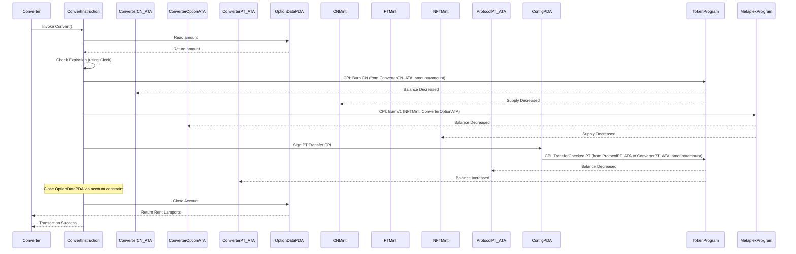

# Convert

The `convert` instruction allows a user to redeem their Convertible Note (`CN`) tokens along with the associated deposit NFT (`nft_mint`) in exchange for Principal Tokens (`PT`) held by the protocol. This effectively closes out their initial deposit position.

**Accounts & Data Inputs Required:**

1. **`converter` (Signer):** The user's wallet signing the transaction, who owns the CN tokens and the NFT.
2. **`converter_cn_ata` (TokenAccount):** The user's ATA holding the `CN` tokens to be burned (mut).
3. **`converter_option_ata` (TokenAccount):** The user's ATA holding the specific deposit NFT to be burned (mut).
4. **`converter_pt_ata` (TokenAccount):** The user's ATA where the received `PT` tokens will be sent (mut, init_if_needed).
5. **`config` (Account<Config>):** The protocol's main configuration PDA (used for mint addresses, seeds, and signing the PT transfer).
6. **`protocol_pt_ata` (TokenAccount):** The protocol's ATA (owned by `config`) holding the `PT` tokens to be transferred to the user (mut).
7. **`cn_mint` (Mint):** The mint address for the protocol's `CN` token (mut, for burn). Checked against `config`.
8. **`pt_mint` (Mint):** The mint address for the protocol's `PT` token (mut, for transfer_checked). Checked against `config`.
9. **`nft_mint` (Mint):** The mint address of the specific deposit NFT being converted/burned (mut).
10. **`option_data` (Account<OptionData>):** The PDA linked to the `nft_mint` containing the `amount` associated with the deposit (mut, closed at end). Seeds: `[OptionData::SEED_PREFIX, nft_mint.key().as_ref()]`.
11. **`nft_metadata`, `nft_master_edition` (UncheckedAccount):** Metaplex accounts associated with the `nft_mint` being burned (mut, required by BurnV1 CPI).
12. **`collection_metadata` (UncheckedAccount):** Metaplex metadata account associated with the main collection (mut, required by BurnV1 CPI).
13. **System Programs:** `token_program` (Token2022), `associated_token_program`, `system_program`, `metadata_program`.
14. **Sysvars:** `sysvar_instructions`, `rent`.

**Execution Flow (`handler` function):**

1. **Pre-Checks:**
    * Verifies that the protocol (`config.locked`) and conversions specifically (`config.convert_locked`) are not locked/paused.
    * Gets the current time using `Clock` and verifies the option is not expired (`!option_data.is_expired(...)`).
    * Reads the `amount` from the `option_data` account (this is the amount to process).
    * Ensures `amount` is greater than zero.
2. **Burn CN Tokens:**
    * Burns `amount` tokens from the `converter_cn_ata` using a Token Program CPI. The `converter` signs this burn.
3. **Burn NFT Option:**
    * Calls the Metaplex `BurnV1` instruction via CPI.
    * This CPI burns the NFT token held in `converter_option_ata`.
    * Requires the `converter` signature and the necessary Metaplex accounts (`nft_metadata`, `nft_master_edition`, `collection_metadata`).
4. **Transfer PT Tokens:**
    * Transfers `amount` (the same amount as CN burned) `PT` tokens from the `protocol_pt_ata` to the `converter_pt_ata`.
    * Uses `transfer_checked` CPI, requiring the `pt_mint` decimals.
    * The `config` PDA signs this transfer as the authority over the `protocol_pt_ata`.
5. **Close `OptionData` Account:**
    * The `option_data` account is closed via the `close = converter` constraint in the account definition.
    * The rent SOL from the closed account is returned to the `converter`.

**Outputs & State Changes:**

* `converter_cn_ata` balance decreases by `amount`.
* `converter_option_ata` balance decreases by 1 (NFT burned).
* `converter_pt_ata` balance increases by `amount`.
* `protocol_pt_ata` balance decreases by `amount`.
* `cn_mint` supply decreases by `amount`.
* `nft_mint` supply decreases by 1.
* `option_data` account is closed and its lamports are transferred to the `converter`.

**Mermaid Diagram Script:**

