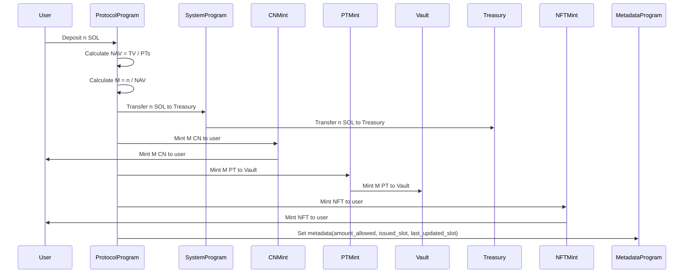

## User Deposit Into the Protocol

In this scenario, the user wants to deposit `n` SOL into the protocol. The protocol should:

- calculate the NAV (Net Asset Value)
- calculate the number (`M`) of tokens to mint: `M = n / NAV`
- mint `M` CN tokens to the user
- mint `M` PT tokens to the vault
- mint a Token2022 NFT to the user with metadata:
  - amount allowed: `M`
  - issue slot: current slot
  - last updated slot: current slot

