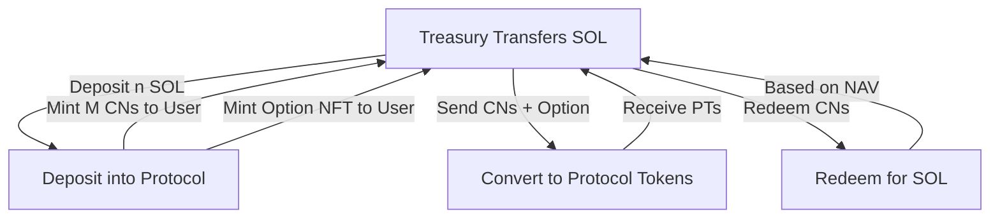

## User Actions Overview

The user interacts with the protocol through a series of actions. The possible actions include:

- Deposit into the protocol
- Convert CNs and NFT Option into Protocol Tokens
- Redeem CNs for SOL

