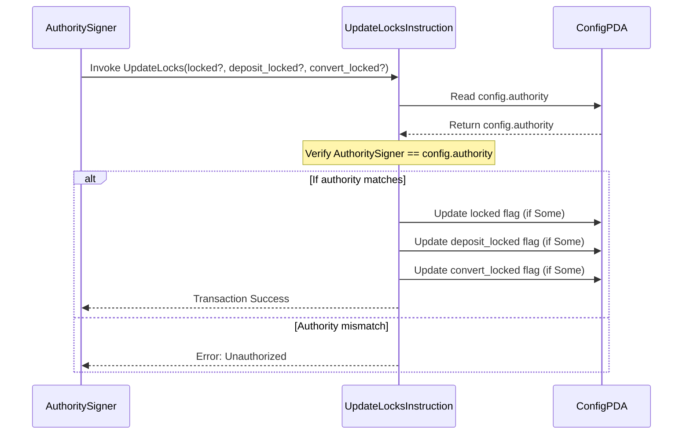

# Admin Instructions

This document outlines administrative instructions available in the protocol.

## Update Locks (`update_locks`)

The `update_locks` instruction allows the configured authority to enable or disable specific protocol functions by setting boolean flags in the `Config` account. This can be used to pause deposits, conversions, or the entire protocol.

**Accounts & Data Inputs Required:**

1. **`authority` (Signer):** The wallet signing the transaction. Must match the `authority` field stored in the `config` account.
2. **`config` (Account<Config>):** The protocol's main configuration PDA (mut). Seeds: `[b"config"]`.
3. **`locked` (Option<bool>):** Instruction data. If `Some(value)`, updates the global `locked` flag.
4. **`deposit_locked` (Option<bool>):** Instruction data. If `Some(value)`, updates the `deposit_locked` flag.
5. **`convert_locked` (Option<bool>):** Instruction data. If `Some(value)`, updates the `convert_locked` flag.

**Execution Flow (`handler` function):**

1. **Authority Check:**
    * Verifies that `config.authority` is set (`is_some()`).
    * Verifies that the public key of the `authority` signer matches the `config.authority`. Fails with `AdminError::Unauthorized` if checks do not pass.
2. **Update Flags:**
    * Checks each optional input (`locked`, `deposit_locked`, `convert_locked`).
    * If an input is `Some(value)`, the corresponding boolean flag in the `config` account is updated to that `value`.
    * Logs messages indicating which locks were updated and their new state.

**Outputs & State Changes:**

* The specified boolean lock flags (`locked`, `deposit_locked`, `convert_locked`) in the `config` account are potentially updated based on the provided instruction data.

**Mermaid Diagram Script:**

