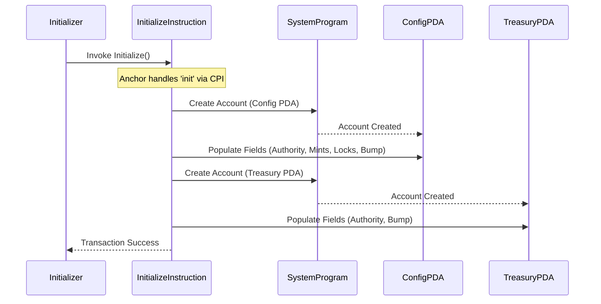

# Initialize

The `initialize` instruction sets up the core state accounts for the protocol: the `Config` PDA and the `Treasury` PDA. It records required addresses (like the token mints), and sets the initial administrative authority.

**Accounts & Data Inputs Required:**

1.  **`initializer` (Signer):** The wallet signing the transaction.
2.  **`cn_mint`, `pt_mint`, `collection_mint` (Mint):** *Existing* mint accounts. The instruction verifies that their mint authority is set to the *future* address of the `config` PDA being created. This ensures the protocol will control these mints after initialization.
3.  **`config` (Account<Config>):** The Config PDA account *to be created* by this instruction. Seeds: `[b"config"]`.
4.  **`treasury` (Account<Treasury>):** The Treasury PDA account *to be created* by this instruction. Seeds: `[b"treasury"]`.
5.  **`option_duration` (u32):** The duration in seconds for which newly minted option NFTs will be valid.
6.  **System Programs:** `system_program`, `token_program` (Token2022).

**Execution Flow (`handler` function):**

1. **Account Creation:**
    * Using the `system_program`, it creates the `config` PDA account with the specified seeds (`[b"config"]`), space, and bump.
    * Similarly, the `treasury` PDA account is created with seeds (`[b"treasury"]`), space, and bump.
    * Rent for both is paid by the `initializer`.

2. **Populate `Config` PDA:**
    * Sets `config.authority` to the `initializer`'s public key.
    * Stores the public keys of the provided `cn_mint`, `pt_mint`, and `collection_mint` accounts.
    * Sets `option_duration` based on the instruction argument.
    * Sets initial values: `fee` to `None`, `option_count` to `0`, `locked` to `false`, `deposit_locked` to `true`, `convert_locked` to `true`.
    * Stores the `bump` used to create the PDA.

3. **Populate `Treasury` PDA:**
    * Sets `treasury.authority` to the `initializer`'s public key.
    * Stores the `treasury_bump` used to create the PDA.
    * (Note: The actual SOL balance holding capability comes from the PDA being owned by the System Program initially, allowing SOL transfers via CPI later).

4. **Logging:** Outputs messages confirming the addresses of the created PDAs, the stored mints, and the authority.

**Outputs & State Changes:**

* A new `Config` PDA account exists on-chain, owned by the program, containing the initial configuration data.
* A new `Treasury` PDA account exists on-chain, owned by the program, containing its initial state (authority and bump).

**Mermaid Diagram Script:**

