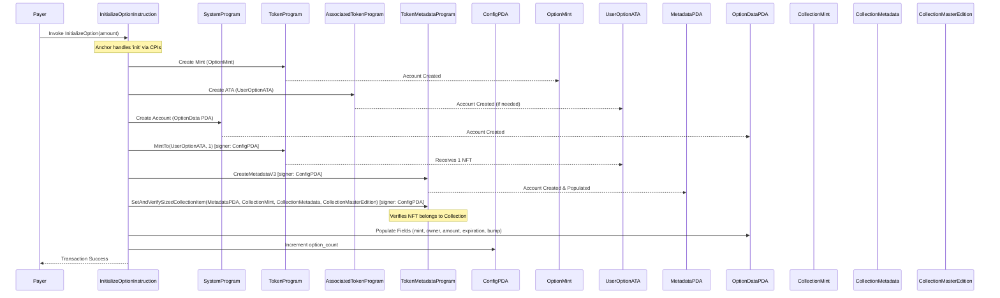

# Initialize Option

## Overview

This instruction initializes a new option represented by a unique NFT (Non-Fungible Token). It creates the NFT mint, metadata, and master edition accounts, mints the NFT to the payer, and creates a corresponding `OptionData` PDA to track option details.

**Accounts & Data Inputs Required:**

1.  **`payer` (Signer):** The wallet signing the transaction, paying for account creation, and receiving the option NFT.
2.  **`config` (Account<Config>, writable):** The existing Config PDA. Seeds: `[Config::SEED_PREFIX]`. Used as authority for minting/metadata, to get parameters like `option_duration`, and to increment `option_count`.
3.  **`option_mint` (Mint, writable):** The NFT mint account *to be created* by this instruction. Authority will be the `config` PDA.
4.  **`user_option_ata` (TokenAccount, writable):** The payer's Associated Token Account for the `option_mint` *to be created* (if needed) by this instruction.
5.  **`metadata_account` (UncheckedAccount, writable):** The Metaplex Metadata PDA *to be created* via CPI. Seeds derived from `option_mint`.
6.  **`collection_mint` (UncheckedAccount):** The mint address of the protocol's main NFT collection (read from `config` and verified against this account).
7.  **`collection_metadata` (UncheckedAccount, writable):** The metadata account associated with the `collection_mint`. Checked via CPI. Writable because verification might update size.
8.  **`collection_master_edition` (UncheckedAccount):** The master edition account associated with the `collection_mint`. Checked via CPI.
9.  **`option_data` (Account<OptionData>, writable):** The OptionData PDA *to be created* by this instruction. Seeds: `[OptionData::SEED_PREFIX, option_mint.key().as_ref()]`.
10. **System Programs:** `token_program` (Token2022), `associated_token_program`, `system_program`, `rent`, `token_metadata_program`.

**Instruction Arguments:**

*   `amount: u64`: The amount associated with this option, used in metadata.

**Execution Flow (`handler` function):**

1.  **Account Creation:** Anchor handles the creation of `option_mint` and `option_data` PDAs via CPIs to the Token and System programs, paid for by `payer`. The `user_option_ata` is also created if needed via CPI to the Associated Token program.
2.  **Calculate Expiration & URI:** Determines the option's expiration timestamp using `Clock` and `config.option_duration`. Formats a metadata URI including the `amount` and `expiration`.
3.  **Mint NFT:** Mints 1 token of the `option_mint` to the `user_option_ata` via CPI to the Token Program, using the `config` PDA as the signer.
4.  **Create Metadata:** Creates the `metadata_account` via CPI (`create_metadata_accounts_v3`) to the Token Metadata program, using `config` as the signer and setting the name, symbol, URI, etc.
5.  **Set and Verify Collection Item:** Links the newly created NFT metadata to the collection via CPI (`set_and_verify_sized_collection_item`) to the Token Metadata program. This requires the `collection_mint`, `collection_metadata`, and `collection_master_edition` accounts. The `config` PDA signs as the update authority for the new NFT's metadata.
6.  **Populate `OptionData` PDA:** Sets the fields: `mint` (key of `option_mint`), `owner` (key of `payer`), `amount`, `expiration`, and the `bump` seed used for its creation.
7.  **Increment Option Count:** Increments the `option_count` in the `config` account.
8.  **Logging:** Outputs a message confirming the option initialization details.

**Outputs & State Changes:**

*   A new `Mint` account (`option_mint`) exists for the NFT.
*   A new Metaplex `Metadata` account exists for the NFT.
*   The NFT is verified as part of the specified collection.
*   The `payer`'s `user_option_ata` holds 1 token of the `option_mint`.
*   A new `OptionData` PDA exists, storing details for this specific option. Its address is derived using the unique `option_mint` key, ensuring uniqueness per option.
*   The `config.option_count` is incremented by 1.

**Mermaid Diagram Script:**

