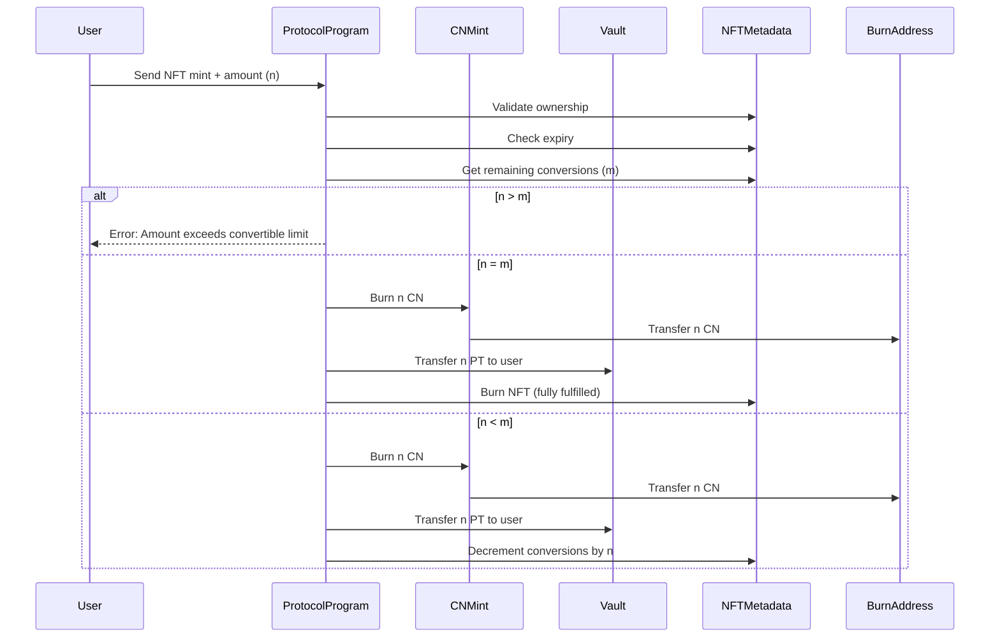

## Convert NFT Option + CN for Protocol Token

For all scenarios, the user is wanting to convert `n` CNs into PTs, and the NFT option metadata specifies `m` allowed conversions.

#### Scenario 1: `n < m`

In this scenario, the user has an NFT with an allowed amount of `m` CN, and they want to convert `n` CN into PT, where `n < m` (they don't have enough CNs to fulfill the entire NFT amount).

To handle the discrepancy, the NFT is updated to account for the new allowed amount.

#### Scenario 2: `n = m`

In this scenario, the user has an NFT with an allowed amount of `m` CN, and they want to convert `n` CN into PT, where `n = m` (they have enough CNs to fulfill the entire NFT amount).

In this case, the NFT is burned at the end of the transaction.

#### Scenario 3: `n > m`

In this scenario, the user has an NFT with an allowed amount of `m` CN, and they want to convert `n` CN into PT, where `n > m` (they have more CNs than the NFT allows).

In this case, the transaction fails and the user is notified that they are trying to convert more CN than allowed by the NFT.

