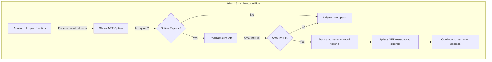

# Handle Expired Options

The `sync` function is an admin only function that takes an array of mint addresses for NFT Options, checks if their expired, and, if they're expired, takes the amount that the option was good for and burns that number of protocol tokens. Because we mint 1 PT for each CN token, this function is maintaining the protocol by insuring that the number of PT tokens held in the protocol vault is equal to the number of CN tokens that are available to claim.

