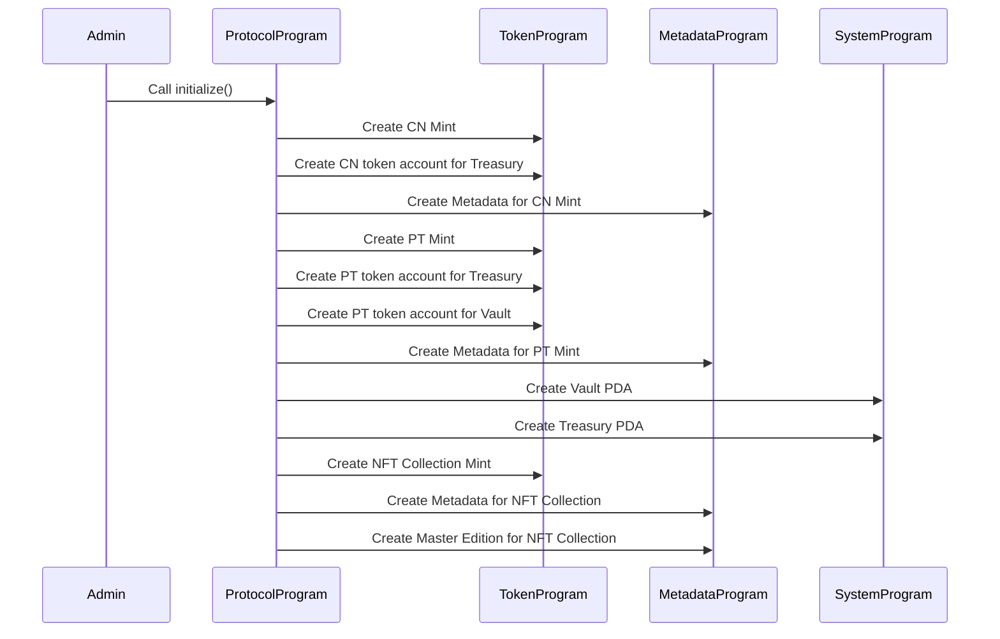

# Initialize protocol

Initialize:

The initialize function is used to initialize the protocol. This function will:

- create a CN mint
- create a CN token account for the treasury
- create a Metadata account for the CN mint
- create a PT mint
- create a PT token account for the treasury
- create a PT token account for the vault
- create a Metadata account for the PT mint
- create a vault PDA
- create a treasury PDA
- create a mint account for the NFT collection
- create a Metadata account for the NFT collection
- create a Master Edition account for the NFT collection

