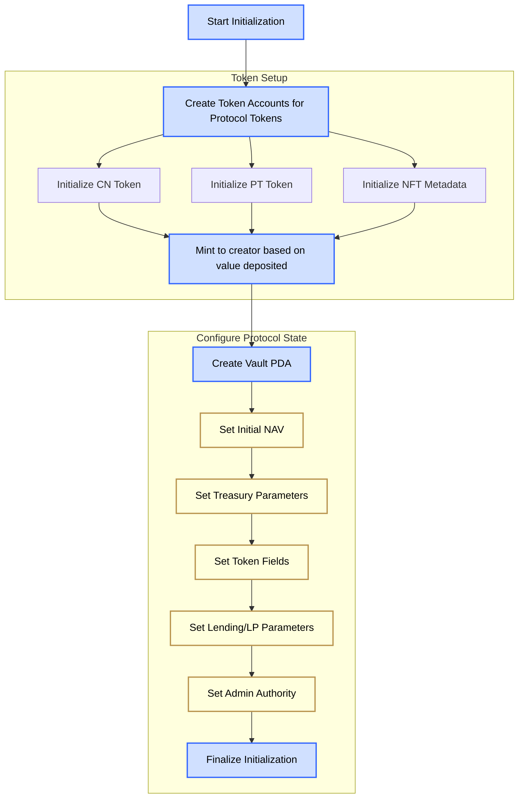

# Initialize protocol

Initialize: 

The initialize function is used to initialize the protocol. It is payable, creates a PDA, creates and mints the initial CN / PT based on the amount paid, initializes the nft and mints the first one, and set initial values for the vault account.

