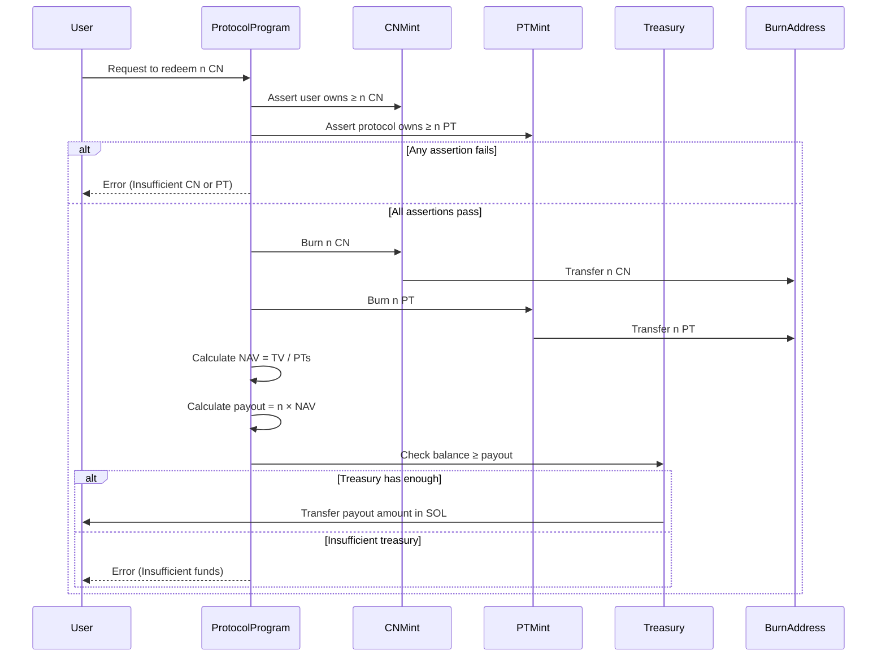

## Redeem CN for SOL

In this scenario, the user wants to redeem `n` CN tokens for SOL. If the user owns `n` CN tokens, the protocol will burn `n` CN and `n` PT tokens. The protocol will then calculate the NAV (Net Asset Value) of the protocol and transfer the equivalent amount in SOL to the user.

